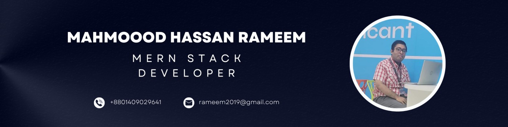

<!-- ========================================================= -->
<!--                       HEADER                              -->
<!-- ========================================================= -->
<div align="center">


<br/>

<a href="https://github.com/rameem2003">

</a>
<a href="https://github.com/rameem2003?tab=followers">

</a>
<a href="https://github.com/rameem2003?tab=repositories">

</a>

</div>

<br/>

<!-- ========================================================= -->
<!--                       INTRO                                -->
<!-- ========================================================= -->
<div align="center">

### 👨‍💻 Full-Stack Developer from Bangladesh 🇧🇩

**MERN Stack Developer&nbsp;•&nbsp;Instructor (Web Development)&nbsp;•&nbsp;Founder @ ROL Studio Bangladesh&nbsp;•&nbsp;BSc CSE**

> Building web apps, mobile apps, real-time systems and AI-powered products end to end — from schema to shipped.

</div>

---

## 🧑‍💻 `whoami`

```javascript
const mahmood = {
  name: "Mahmood Hassan Rameem",
  username: "rameem2003",
  location: "Bangladesh 🇧🇩",

  role: [
    "Full-Stack Developer",
    "MERN Stack Developer",
    "React Native Developer",
  ],

  company: "Founder @ ROL Studio Bangladesh",

  currentlyLearning: [
    "System Design",
    "TypeScript at scale",
    "AI / LLM application architecture",
  ],

  funFact: "Just create an HTML file then you will be a NASA hacker 🚀",
};
```

---

## ⚡ What I Do

<table>
<tr>
<td align="center" width="25%">

### 🌐

### Web Apps

React
Next.js
Tailwind
ShadCN

</td>
<td align="center" width="25%">

### ⚙️

### Backend

Node.js
Express.js
REST APIs
Socket.IO

</td>
<td align="center" width="25%">

### 📱

### Mobile

React Native
Expo
Android
Firebase

</td>
<td align="center" width="25%">

### 🤖

### AI / LLM

Ollama
RAG Pipelines
Stable Diffusion
Prompt Engineering

</td>
</tr>
</table>

---

## 🛠️ Tech Arsenal

<div align="center">

**Frontend**
<br/>


<br/><br/>

**Backend & Database**
<br/>


<br/><br/>

**Mobile & Tools**
<br/>


</div>

<!-- ## 🧪 Currently Building

<div align="center">

| Project                       | What it is                                                                                | Stack                                                   |
| ----------------------------- | ----------------------------------------------------------------------------------------- | ------------------------------------------------------- |
| 🤖 **DevCraft AI**            | AI-powered app with local LLM inference, image generation, and RAG-style web search       | `Next.js 16` `Ollama` `Stable Diffusion` `SSE` `Tavily` |
| 🔐 **User Management System** | Production-grade auth scaffold — refresh-token rotation, OTP, KYC triggers, audit logging | `Express` `MongoDB` `Redis` `BullMQ` `JWT`              |
| 💬 **Real-Time Chat Backend** | Expo chat app backend — typing indicators, read receipts, group chat, push notifications  | `React Native` `Socket.IO` `Expo`                       |

</div> -->

---

## 🚀 Featured Projects

<div align="center">

### 💬 Golpo Chat

**Real-time Android messaging application**

<a href="https://golpochat.vercel.app/"></a>
<a href="https://github.com/rameem2003/golpo-chat"></a>

<br/><br/>

`React Native` `Expo` `TypeScript` `Node.js` `Express` `MongoDB` `Socket.IO`

---

### 🛍️ Shari Mohol

**E-commerce platform for ladies' fashion**

<a href="https://github.com/rameem2003/shari-mohol-ecommerce"></a>

<br/>

`Next.js` `React` `Express.js` `MongoDB` `Redux` `ShadCN`

---

### 🎓 Velocity Tech Academy

**Learning Management System**

<a href="https://www.velocitytechacademy.com/"></a>

<br/>

`Next.js` `ShadCN` `Express.js` `Node.js` `MongoDB` `Redux` `SSLCommerz`

---

### 🎓 Hello NUBian

**Student-focused Android application**

<a href="https://play.google.com/store/apps/details?id=com.rol.nubian&hl=en"></a>

<br/>

Notices • Assignments • Exam Dates • Sections

<br/>

`React Native` `Express.js` `Node.js` `MongoDB` `Redux` `NativeWind`

---

### 🏢 Noyon Puspo Beli

**Full-stack event management platform**

<a href="https://www.noyonpuspobelievent.com/"></a>
<a href="https://github.com/rameem2003/noyon-puspo-beli-event-managment"></a>

<br/>

`React` `Express.js` `Node.js` `MongoDB` `Redux` `Tailwind CSS`

---

### 🏢 ROL Studio Bangladesh

**Official website of ROL Studio Bangladesh**

<a href="https://github.com/rameem2003/rol-studio-bangladesh"></a>

<br/>

`Next.js` `React` `Tailwind CSS` `Full-Stack`

</div>

---

## 🌐 More Projects

| Project                      | Description                        | Demo / Store                                                                     | Source                                                                   |
| ---------------------------- | ---------------------------------- | -------------------------------------------------------------------------------- | ------------------------------------------------------------------------ |
| 💬 **Golpo Chat**            | Real-time Android chat application | [Live](https://golpochat.vercel.app/)                                            | [GitHub](https://github.com/rameem2003/golpo-chat)                       |
| 🎓 **Velocity Tech Academy** | Learning Management System         | [Live](https://www.velocitytechacademy.com/)                                     | [GitHub](https://github.com/rameem2003)                                  |
| 🛍️ **Shari Mohol**           | Ladies fashion e-commerce          | Coming Soon                                                                      | [GitHub](https://github.com/rameem2003/shari-mohol-ecommerce)            |
| 🎓 **Hello NUBian**          | Student mobile application         | [Play Store](https://play.google.com/store/apps/details?id=com.rol.nubian&hl=en) | [GitHub](https://github.com/rameem2003)                                  |
| 🏢 **Noyon Puspo Beli**      | Event management platform          | [Live](https://www.noyonpuspobelievent.com/)                                     | [GitHub](https://github.com/rameem2003/noyon-puspo-beli-event-managment) |
| 🛒 **SM Corporation**        | E-commerce + Admin Panel           | [Live](https://www.mssmcorporation.com/)                                         | [GitHub](https://github.com/rameem2003)                                  |

---

## 📊 GitHub Analytics

<div align="center">


<br/><br/>


<br/>

</div>

---

## 🌐 Connect With Me

<div align="center">

<a href="https://rameem.netlify.app/"></a>
<a href="https://www.linkedin.com/in/mahmood-hassan-rameem/"></a>
<a href="https://twitter.com/MHRameem2003"></a>
<a href="https://fb.com/mahmood.rameem"></a>
<a href="https://www.youtube.com/@we.are.republicoflegends2022"></a>
<a href="mailto:rameem2019@gmail.com"></a>

</div>

<br/>

<div align="center">

</div>

